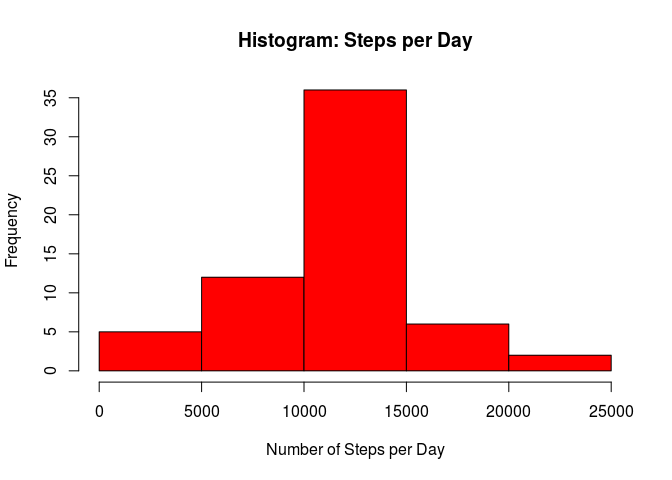

# Reproducible Research: Peer Assessment 1


## Loading and preprocessing the data

The following script performs the data load, from the file "activity.csv".
This script also process the data, since the imported date should be treat as
a date object, not a string.


```r
    input_file = "activity.csv"
    
    src_dir = "./"
    
    # Load data.table package
    suppressPackageStartupMessages(library('data.table', character.only = TRUE));
    
    ## Initialization of directoryy that contains the figures presented in this
    ## report
    dir.create(file.path(src_dir, "figures"), showWarnings = FALSE);

    # Read de file and create a data table object
    activityData <- fread(paste(src_dir, input_file, sep = ""), 
                          header = T);
    
    ## Change the information in column "date" from string to date type.
    activityData[, date := as.Date(date)];
```


## What is mean total number of steps taken per day?

The following script is used to plot a histogram, using the loaded data, related 
to the number of steps per day, ignoring registers that have missing information.
After the script, is presented the resulting plot.


```r
    ## From the loaded date, perfomrs the loop to calculate the sum of steos
    ## by date
    stepsPerDay <- activityData[!is.na(steps), lapply(.SD, sum), by = date, .SDcols = 1]
    

    ## Builds the histogram of steps per day
    hist(stepsPerDay$steps, col = "blue", 
         xlab = "Number of Steps per Day",
         main = "Histogram: Steps per Day")
```


```r
    ## Save the plot in the paste figures
    invisible(dev.copy(png, filename = "figures/histQuestion1.png"));
    invisible(dev.off());
```

The mean of steps per day is **10766.19** and the median is **10765**. This
values are obtained through the script as follows. Just after, is presented the 
output of this script.


```r
    ## Prints the mean and median of steps per day
    cat("Question 1 results:\n"
        ,"\tMeans total number of steps taken per day: ", mean(stepsPerDay$steps), "\n"
        ,"\tMedian total number of steps taken per day: ", median(stepsPerDay$steps), "\n");
```

```
## Question 1 results:
##  	Means total number of steps taken per day:  10766.19 
##  	Median total number of steps taken per day:  10765
```

## What is the average daily activity pattern?

In order to answer this question, is necessary to calculate the average of steps 
by each 5 minutes interval, considering all days. The following script performs
this calculation and plots the result. 

How about the interval that presents the maximum number of steps? This value
corresponds the maximum average in the graphic, which is also performed by the
script and presented in the plot. 
So, with an average of approximately **206**, the interval with more steps is 
the **835**. 


```r
    ## From the loaded date, perfomrs the loop to calculate the average of steos
    ## by interval, across all days.
    stepsAcrossPeriods <- activityData[!is.na(steps), lapply(.SD, mean), 
                                       by = interval, .SDcols = 1];
    
    ## Change the average steps column to "avgSteps"
    setnames(stepsAcrossPeriods, 2, "avgSteps");

    ## Perform the plot
    plot(stepsAcrossPeriods$interval, stepsAcrossPeriods$avgSteps,
         type = "l", xlab = "Intervals (min)", col = "black",
         ylab = "Average Number of Steps", 
         main = "Average Steps by interval (5 minutes sample)");
    
    ## Find the maximum average value
    maxAvg = max(stepsAcrossPeriods$avgSteps);
    
    ## Shows, in plot, the maximum average and corresponding interval.
    with(subset(stepsAcrossPeriods, avgSteps == maxAvg), 
         text(interval, 0.97*avgSteps, paste("Average = ", 
                                             format(round(avgSteps, 2), 
                                                    nsmall = 2), 
                                             "\nInterval = ", interval), 
              cex = 0.75, pos = 4));
```


```r
    ## Save the plot in the paste figures
    invisible(dev.copy(png, filename = "figures/plotQuestion2.png"));
    invisible(dev.off());
```
## Imputing missing values

There is **2304** rows with missing step information, result obtained through
the following script (followed by the script output):


```r
    ## Generates a dataset with the total of missing data per day
    missingData <- activityData[is.na(steps), ];
    
    cat("Question 3 results:\n"
        ,"\tTotal number of missing data: ", nrow(missingData), "\n");
```

```
## Question 3 results:
##  	Total number of missing data:  2304
```

The rows intervals with no step information in original dataset were filled with
the corresponding average of steps for the period. The following script performs
this operation and plots the histogram of steps per day.


```r
    completeActivityData <- copy(activityData)
    
    ## Fill the missing data with the average of the corresponding period
    completeActivityData[is.na(steps), steps := as.integer(lapply(interval, 
            function(pInterval) {
                round(stepsAcrossPeriods[interval == pInterval, avgSteps]);
    }))];
    
    ## From the loaded date, perfomrs the loop to calculate the sum of steos
    ## by date
    completeStepsPerDay <- completeActivityData[!is.na(steps), lapply(.SD, sum), by = date, .SDcols = 1]
        
    ## Builds the histogram of steps per day
    hist(completeStepsPerDay$steps, col = "red", 
         xlab = "Number of Steps per Day",
         main = "Histogram: Steps per Day")
```



```r
    ## Save the plot in the paste figures
    invisible(dev.copy(png, filename = paste("figures/", "histQuestion3.png")));
    invisible(dev.off());
```

Filling the data in this way, is not expected significant changes in the mean
and the median, because this data follows the "pattern" of the previous dataset.
The following script presents the results related to the new dataset and 
supports the conclusions. (results from the script are presented as follows).

The results for mean and median of steps by interval across days are, 
repectively, **10765.64** and **10762**.


```r
    ## Prints the mean and median of steps per day
    cat("Question 3 results:\n"
        ,"\tMeans total number of steps taken per day: ", mean(completeStepsPerDay$steps), "\n"
        ,"\tMedian total number of steps taken per day: ", median(completeStepsPerDay$steps), "\n");
```

```
## Question 3 results:
##  	Means total number of steps taken per day:  10765.64 
##  	Median total number of steps taken per day:  10762
```

## Are there differences in activity patterns between weekdays and weekends?

Tho verify the patterns betweens steps from weekdays and weekends, the following
script was elaborated to produce a plot that allow the visualization of these
patterns. Seems that in weekdays, there is more movement at the beginning of the
day and in the weekends, the steps are more equality distributed in the middle 
of the day.


```r
   # Load data.table package
    suppressPackageStartupMessages(library('lattice', character.only = TRUE));
    
    # Just to set the correct locale for comparison
    osType = .Platform$OS.type
    if(osType == "unix") 
    {
        invisible(Sys.setlocale("LC_TIME", "en_US.UTF-8"));
    }  else {
        invisible(Sys.setlocale("LC_TIME", "English"));
    }
  
    # Load data.table package
    activityData[, isWeekend := factor( as.numeric(lapply(date, function(pdate) {
        name <- toupper(weekdays(pdate, abbreviate = T));
        (identical(name, "SUN") || identical(name, "SAT"))
    })), levels = c(1,0), labels = c("Weekend", "Weekday") )];
    
    ## From the loaded date, perfomrs the loop to calculate the average of steos
    ## by interval, across all days.
    stepsAcrossPeriods <- activityData[!is.na(steps), lapply(.SD, mean), 
                                       by = list(interval, isWeekend), 
                                       .SDcols = 1];
    
    ## Change the average steps column to "avgSteps"
    setnames(stepsAcrossPeriods, 3, "avgSteps");
    
    ## PLot the average of steps per period, for weehdays and weekends
    q4Plot <- xyplot(stepsAcrossPeriods$avgSteps ~ stepsAcrossPeriods$interval
           | stepsAcrossPeriods$isWeekend, 
           main="Number of Steps by Interval (5 minutes sample)", 
           ylab="Average Number of Steps", xlab="Interval", type = "l");
    
    print(q4Plot);
```


```r
    ## Save the plot in the paste figures
    invisible(dev.copy(png, filename = paste("figures/", "plotQuestion4.png")));
    invisible(dev.off());
```

#### **NOTE: The included script *run_analysis.R* in this repository, contains the code presented in this reports, organized in order to produce all results presented here in a more easy way**
